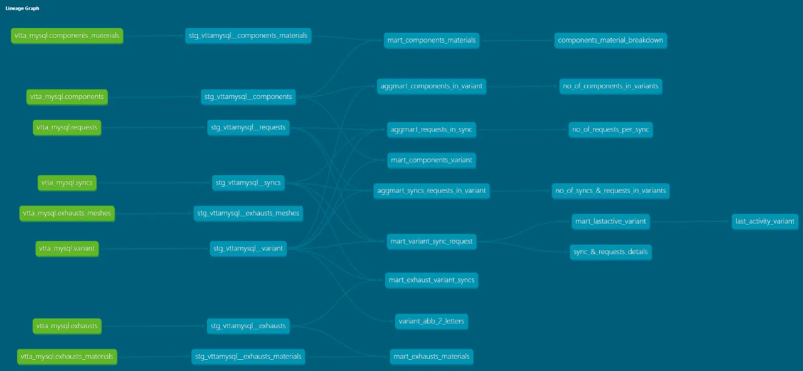

# Engineering Simulation Data Warehouse - Phase 2 DBT layer & hosting on Azure using MySQL Server

This is a continuation of the data warehouse project built in this repo: [[link](https://github.com/NohaKhaled01/EngineeringSimulationDataWarehouse)]. This project's goal is to build a dbt layer for the transformation of the data extracted, in addition to hosting the warehouse on Azure's Cloud services, using MySQL server.

## Project Goal:

Originally, the whole ETL layer was set up inside the python scripts, which extracted data from data sources, transformed them into their final format, then loaded them into the locally hosted MySQL server.

This project's goal is to host the warehouse on Azure's Cloud service, using MySQL server, replace part of the transformation layer to the dbt layer, create final mart tables that answer recurring questions readily. And finally, attempt to automate the data ingestion in the events of new data getting added to the blob storage.

## Stack:

| Layer          | Tool                                       |
| -------------- | ------------------------------------------ |
| Cloud database | Azure Database for MySQL (Flexible Server) |
| Extraction     | Python (pandas, SQLAlchemy)                |
| Transformation | dbt (staging → marts, tests, docs)         |
| Access         | Least-privilege read-only database users   |

## The Azure layer:

The data warehouse was hosted on Azure using MySQL server. In addition to the MySQL server, a blob storage container was created, in a planned attempt to automate the data ingestion process when data lands in the blob storage.

The automation layer was planned out as follows:
```
New file lands in Blob Storage  ──►  Azure Function (blob trigger)  ──►  loads raw tables  ──►  dbt build refreshes marts
```
It was attempted using 'functions' inside Azure but was eventually blocked due to a compatibility gap between the hosting plan and the event routing system used in Azure. The event routing system, known as Azure Event Grid, is an event routing system that allows the building of event-driven processes. The Flex Consumption plan was the hosting plan used for this project. The compatibility gap occurred when the deployed function, which is a piece of code that should be carried out when an event is detected, was not recognized by the event grid, which caused the whole automation layer to fail.

The better option would've been to either use the premium plan, or to use Azure Data Factory instead of the functions feature, but this step would've prolonged this project more than necessary, and it is planned out for the next phase of this project either ways, which is hosting the ware house on a Azure SQL server instead of MySQL server.

## The DBT layer:

- Staging (models/staging):

One model per raw table. Staging cleans, renames, and types each source as a separate view

- Marts (models/marts):

Denormalized, question-based tables that come from joining staging models to answer recurring questions

- Flat marts are staging models joined together, without any other operation. They are labelled with 'marts_' at the beginning of the file name.

- Aggregating marts are staging models joined together and filtered/grouped by various columns, and having aggregate functions performed (sums/counts). They are labelled with 'aggmart_' at the beginning of the file name

- Tests & Macros (models/tests & models/*/.yml & macros/):

    - Unique, not null, relationships, and values constraint tests performed in the yml files for the staging and the marts models.

    - A special one-time test done on the project abbreviation column inside projects is placed inside models/tests (project_abb_2_letters.sql')

    - A recurring date order test is placed inside macros (date_order_test.sql')

- Documentation:

Every model and column described, and lineage graph generated with 'dbt docs'



## DBT Design decisions

I.  Staging layer:

Most of the cleaning is still carried out in the python scripts, with the dbt layer carrying some of the transformation, in addition to extensive testing on the resulting data.

Moving most of the cleaning to the dbt would require the re-structuring of all the scripts and the warehouse structure, which is beyond the scope of this project.

In addition, this will be explored more in the next project, using Azure SQL Server instead of MySQL Server, along with the automation using data factory, where the whole process will need to be re-structured. More on this project here [link].

I.  Denormalized marts:

- Marts were designed in a question-oriented method, instead of a dimension-fact method, as this was more suitable for the expected usage of the warehouse.

- Each mart has one explicit grain, specified in the mart description in the documentation.

## Database Usage

This database is designed to be used by engineering and team members querying and looking for answers inside the data. The following were carried out to aid in that:

I.  All users were granted read-only 'select' privileges, which allows them to query and manipulate the data, without the danger of over-writing or deleting any data.

II. Example queries are provided inside the model files in the analyses folder, with each file containing query that answers a recurring question.

III. A connection guide was written and is provided to users, entailing their privileges, how to connect and the kind of data that will be provided to them, in addition to troubleshooting common connection errors.

## Repository structure

```
models/
├── staging/     stg_* models + sources + tests/descriptions
└── marts/       mart_* and aggmart_* models + tests/descriptions
macros/          custom generic tests
tests/           singular (business-rule) tests
analyses/        example queries against the marts
dbt_project.yml
packages.yml
CONNECTION_GUIDE.md
```
